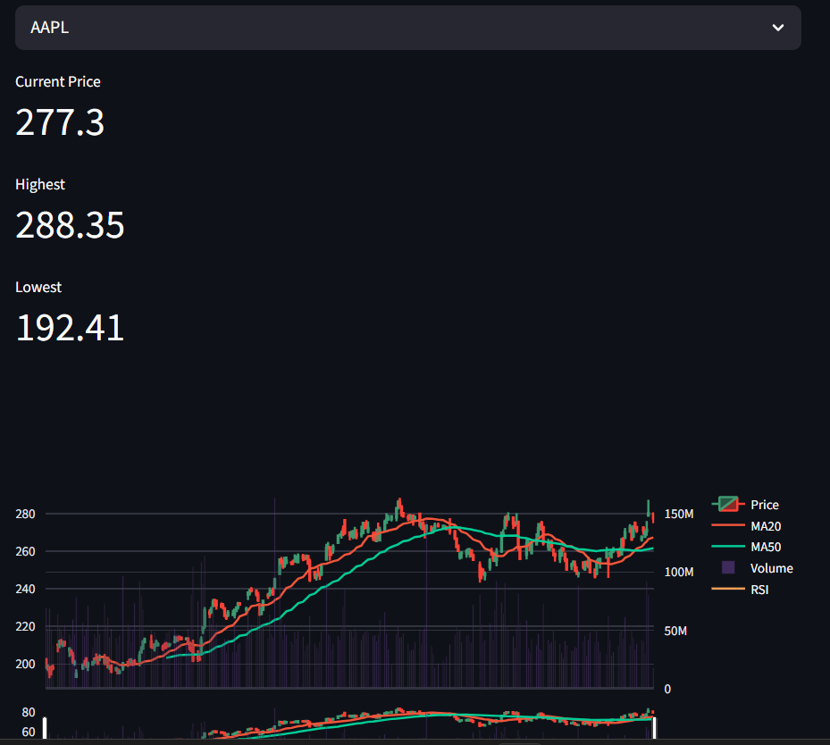
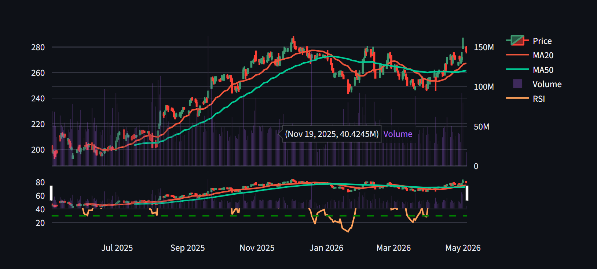

# 📈 Stock Dashboard (Streamlit)

A real-time stock analysis dashboard built using Python and Streamlit.
This app allows users to visualize stock price movements with technical indicators like Moving Averages and RSI.
But ticker should available in yahoo finance

---

##  Live App

👉 https://stock-basic-dashboard.streamlit.app

---

## ✨ Features

* 📊 Interactive candlestick chart
* 📉 Moving Averages (MA20 & MA50)
* 📈 RSI (Relative Strength Index) indicator
* 📦 Volume visualization
* 🔍 Search or select stock ticker
* ⏳ Multiple time period selection
* ⚡ Fast and responsive UI

---

## 🛠️ Tech Stack

* Python
* Streamlit
* yFinance API
* Pandas
* Plotly

---

## 📷 Screenshot

### Overview

### Stock DashBoard

### Ticker Selector

### Time Selection

### Volume


---

## ⚙️ Installation (Run Locally)

```bash
git clone https://github.com/cheattiger07/Stock-basic-dashboard.git
cd Stock-basic-dashboard
pip install -r requirements.txt
streamlit run streamlit_app.py
```

---

## 🧠 What I Learned

* Building interactive dashboards
* Working with financial APIs
* Data visualization with Plotly
* Deploying apps using Streamlit Cloud
* Handling user input and UI design

---

## 📌 Future Improvements

* 🔔 Price alerts
* 📊 Multi-stock comparison
* 🌐 Next.js full-stack version
* 💾 Save favorite stocks (database)

---

## 👨‍💻 Author

Praavin Gopinath

---

## ⭐ If you like this project

Give it a star ⭐ on GitHub!
